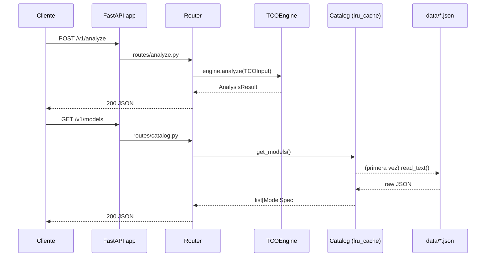
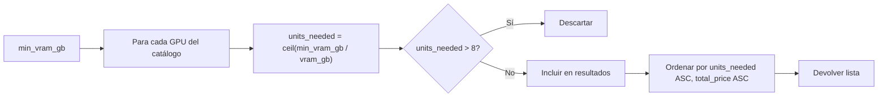

# 🔌 API REST — klaUS-aicalc-roi

## 🤔 ¿Qué hago? ¿Cómo lo hago? ¿Y para qué lo hago?

**¿Qué hago?**
Expongo el TCO engine como una API HTTP REST, convirtiendo análisis de coste de infraestructura AI en un servicio consumible por cualquier cliente: frontend Next.js, CLI, integraciones Slack/Teams o scripts de automatización.

**¿Cómo lo hago?**
Construida con FastAPI sobre el TCO engine existente. Cuatro endpoints: health check, catálogo de modelos (con filtros), catálogo de hardware y el endpoint de análisis TCO. El catálogo se carga de los ficheros JSON estáticos y se cachea en memoria con `lru_cache` — cero latencia de I/O en producción. La validación de entrada/salida es 100% Pydantic v2.

**¿Y para qué lo hago?**
Es el contrato público del sistema. Sin esta capa, el engine es una librería Python que solo puede usarse desde código Python. Con ella, el engine es un servicio independiente que puede desplegarse, versionarse y consumirse desde cualquier lenguaje o herramienta.

---

## 🗺️ Flujo de una petición



---

## 📁 Estructura de ficheros

```
backend/api/
├── __init__.py
├── app.py          # FastAPI instance + registro de routers
├── catalog.py      # Loader con lru_cache — lee data/*.json
└── routes/
    ├── __init__.py
    ├── health.py   # GET /health
    ├── catalog.py  # GET /v1/models · GET /v1/hardware · GET /v1/hardware/recommend
    └── analyze.py  # POST /v1/analyze
```

---

## 🚀 Arrancar el servidor

```bash
# Desde la raíz del repo
uv run uvicorn backend.api.app:app --reload

# Producción (sin reload)
uv run uvicorn backend.api.app:app --host 0.0.0.0 --port 8000

# Swagger UI disponible en:
# http://localhost:8000/docs

# ReDoc disponible en:
# http://localhost:8000/redoc
```

---

## 📋 Endpoints

### `GET /health` — Liveness probe

Devuelve el estado del servicio y la versión. Usar para healthchecks de Kubernetes/Docker.

**Respuesta:**
```json
{
  "status": "ok",
  "version": "0.1.0"
}
```

---

### `GET /v1/models` — Catálogo de modelos

Devuelve el catálogo completo de modelos AI. Acepta filtros opcionales por query param.

| Parámetro | Tipo | Valores | Descripción |
| --- | --- | --- | --- |
| `deployment_type` | `string` | `cloud_api`, `local`, `cloud_gpu`, `hybrid` | Filtrar por tipo de despliegue |
| `data_residency` | `string` | `us`, `eu`, `local`, `apac`, `china` | Filtrar por residencia de datos |

**Ejemplos:**

```bash
# Todos los modelos (30)
curl http://localhost:8000/v1/models

# Solo cloud API (20)
curl "http://localhost:8000/v1/models?deployment_type=cloud_api"

# Solo modelos EU (3 — Mistral)
curl "http://localhost:8000/v1/models?data_residency=eu"

# Combinado: cloud_api en US
curl "http://localhost:8000/v1/models?deployment_type=cloud_api&data_residency=us"
```

> ⚠️ Los 3 modelos `data_residency=china` (DeepSeek V3, DeepSeek R1, Qwen 2.5 72B) son devueltos por este endpoint pero quedan **excluidos por defecto** en `/v1/analyze` por `ComplianceFilter.exclude_china_models=true`.

---

### `GET /v1/hardware` — Catálogo de hardware

Devuelve las 20 configuraciones de hardware GPU disponibles para inferencia local.

```bash
curl http://localhost:8000/v1/hardware
```

---

### `GET /v1/hardware/recommend` — Recomendación de hardware para un modelo 🆕

Dado el requisito de VRAM de un modelo local, devuelve todas las opciones del catálogo ordenadas por el mínimo de unidades necesarias y precio total. El frontend lo usa para auto-seleccionar el hardware óptimo cuando el usuario elige un modelo local.

| Parámetro | Tipo | Requerido | Descripción |
| --- | --- | --- | --- |
| `min_vram_gb` | `float` | ✅ | VRAM mínima requerida por el modelo, en GB (debe ser > 0) |

**Lógica de recomendación:**

- Para cada GPU del catálogo: `units_needed = ceil(min_vram_gb / hw.vram_gb)`
- Se excluyen opciones que requieren más de 8 unidades
- Resultados ordenados por `(units_needed ASC, total_price_usd ASC)` — la opción más barata con menos unidades aparece primera

**Respuesta:** `list[HardwareRecommendation]`

| Campo | Tipo | Descripción |
| --- | --- | --- |
| `hardware` | `HardwareSpec` | Especificación completa de la GPU |
| `units_needed` | `int` | Unidades mínimas necesarias para cubrir `min_vram_gb` |
| `total_vram_gb` | `float` | VRAM total disponible con `units_needed` unidades |
| `total_price_usd` | `Decimal` | Precio de compra total (unidad × units_needed) |

**Ejemplos:**

```bash
# Modelo de 7B — cabe en prácticamente cualquier GPU con 1 unidad
curl "http://localhost:8000/v1/hardware/recommend?min_vram_gb=6"
# → Lista ordenada, primer resultado: GPU más barata de 1 unidad

# Modelo de 70B — necesita ~40 GB VRAM
curl "http://localhost:8000/v1/hardware/recommend?min_vram_gb=40"
# → Incluye opciones de 1 unidad (A100 80GB) y multi-GPU (RTX 4090 ×2)

# Modelo imposible — ninguna GPU puede en ≤8 unidades
curl "http://localhost:8000/v1/hardware/recommend?min_vram_gb=10000"
# → []

# Validación de error — min_vram_gb debe ser > 0
curl "http://localhost:8000/v1/hardware/recommend?min_vram_gb=0"
# → 422 Unprocessable Entity
```



---

### `POST /v1/analyze` — Análisis TCO

El endpoint principal. Acepta un `TCOInput` y devuelve un `AnalysisResult` con todas las estrategias, la frontera Pareto y la recomendación óptima.

**Body:** `TCOInput`

| Campo | Tipo | Requerido | Default | Descripción |
| --- | --- | --- | --- | --- |
| `models` | `list[ModelSpec]` | ✅ | — | Al menos 1 modelo |
| `hardware` | `list[HardwareSpec]` | ❌ | `[]` | Requerido para estrategias local |
| `use_cases` | `list[UseCase]` | ✅ | — | Al menos 1 caso de uso |
| `compliance` | `ComplianceFilter` | ❌ | `exclude_china=true` | Filtros de cumplimiento |
| `electricity_cost_usd_kwh` | `Decimal` | ❌ | `0.25` | Precio electricidad USD/kWh |
| `horizon_months` | `int` | ❌ | `36` | Horizonte análisis (1–120) |

**Respuesta:** `AnalysisResult`

| Campo | Tipo | Descripción |
| --- | --- | --- |
| `strategies` | `list[StrategyCost]` | Una entrada por cada combinación modelo+hardware válida |
| `pareto_optimal_ids` | `list[str]` | IDs de estrategias en la frontera coste/calidad |
| `recommendation` | `Recommendation \| null` | La mejor opción con justificación y riesgos |
| `excluded` | `list[{model_id, reason}]` | Combinaciones descartadas y por qué |

**Ejemplo — análisis cloud vs local:**

```bash
curl -X POST http://localhost:8000/v1/analyze \
  -H "Content-Type: application/json" \
  -d '{
    "models": [
      {
        "id": "claude-sonnet-4-6",
        "name": "Claude Sonnet 4.6",
        "provider": "Anthropic",
        "deployment_type": "cloud_api",
        "context_window": 200000,
        "data_residency": "us",
        "input_price_per_mtok": "3.0",
        "output_price_per_mtok": "15.0"
      },
      {
        "id": "llama-3-1-8b",
        "name": "Llama 3.1 8B",
        "provider": "Meta",
        "deployment_type": "local",
        "context_window": 128000,
        "data_residency": "local",
        "parameters_b": 8,
        "min_vram_gb": 6.0,
        "tokens_per_second_fp16": 120.0
      }
    ],
    "hardware": [
      {
        "id": "rtx-4090",
        "name": "NVIDIA RTX 4090",
        "vram_gb": 24.0,
        "tdp_watts": 450,
        "purchase_price_usd": "2755"
      }
    ],
    "use_cases": [
      {
        "id": "coding",
        "name": "Coding Assistant",
        "monthly_input_tokens": 10000000,
        "monthly_output_tokens": 4000000
      }
    ],
    "horizon_months": 36
  }'
```

**Ejemplo — usar datos del catálogo directamente:**

```bash
# 1. Obtener modelos del catálogo
CLAUDE=$(curl -s "http://localhost:8000/v1/models" | jq '.[] | select(.id == "claude-sonnet-4-6")')
LLAMA=$(curl -s "http://localhost:8000/v1/models" | jq '.[] | select(.id == "llama-3-1-8b-local")')
RTX=$(curl -s "http://localhost:8000/v1/hardware" | jq '.[] | select(.id == "rtx-4090-24gb")')

# 2. Lanzar análisis
curl -X POST http://localhost:8000/v1/analyze \
  -H "Content-Type: application/json" \
  -d "{\"models\": [$CLAUDE, $LLAMA], \"hardware\": [$RTX], \"use_cases\": [...], \"horizon_months\": 36}"
```

---

## 🔒 Seguridad y compliance

El engine aplica `ComplianceFilter` **por defecto** en cada petición:

```mermaid
flowchart TD
    A[TCOInput recibido] --> B{exclude_china_models?}
    B -- true por defecto --> C[Excluir data_residency=CHINA]
    B -- false explícito --> D[Incluir todos los modelos]
    C --> E{allowed_residencies vacío?}
    D --> E
    E -- vacío --> F[Sin filtro de residencia]
    E -- lista --> G[Solo residencias permitidas]
    F --> H[ComplianceChecker]
    G --> H
    H --> I[required_standards check]
    I --> J[AnalysisResult con excluded[]]
```

Para sobrescribir el filtro de China:
```json
{
  "compliance": {
    "exclude_china_models": false
  }
}
```

Para restringir a solo residencia EU:
```json
{
  "compliance": {
    "allowed_residencies": ["eu", "local"]
  }
}
```

---

## ⚡ Performance

| Característica | Detalle |
| --- | --- |
| Carga del catálogo | `lru_cache` — O(1) tras primera petición |
| Validación Pydantic | ~0.1ms por payload típico |
| Cálculo TCO | O(n×m) donde n=modelos, m=hardware — lineal |
| Latencia típica | <5ms para análisis de 30 modelos × 10 hardware |

---

## 🧪 Tests

```bash
# Solo tests de API
uv run pytest backend/tests/test_api.py -v

# Suite completa (50 tests, cobertura 98%)
uv run pytest
```

Los tests de API cubren:
- ✅ `GET /health` — respuesta correcta
- ✅ `GET /v1/models` — catálogo completo + filtros + validación 422
- ✅ `GET /v1/hardware` — catálogo completo
- ✅ `POST /v1/analyze` — coste cloud, exclusión China, datos reales del catálogo, boundaries de horizon, validación 422

---

## 🔗 Documentos relacionados

- [TCO Engine](tco-engine.md) — motor de cálculo que esta API expone
- [Data Catalog](data-catalog.md) — catálogo estático de modelos y hardware
