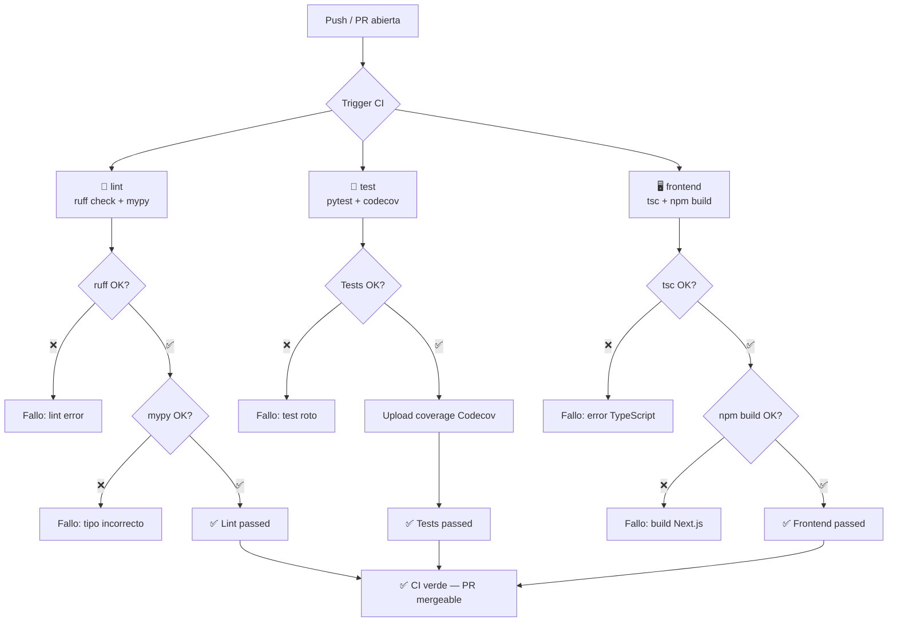

# ⚙️ CI/CD — klaUS-aicalc-roi

## 🤔 ¿Qué hago? ¿Cómo lo hago? ¿Y para qué lo hago?

**¿Qué hago?**
Soy el pipeline de integración continua del proyecto. Verifico automáticamente que cada push y cada PR no rompe el backend ni el frontend — lint, tipos estáticos, tests y build de producción.

**¿Cómo lo hago?**
Un único workflow de GitHub Actions (`.github/workflows/ci.yml`) con tres jobs paralelos:
- `lint`: ruff + mypy sobre el código Python del backend
- `test`: pytest con upload de cobertura a Codecov
- `frontend`: tsc + `npm run build` sobre la capa Next.js

Los tres jobs se ejecutan en `ubuntu-latest` sin dependencias entre sí — fallan de forma independiente y en paralelo, maximizando la velocidad de feedback.

**¿Y para qué lo hago?**
Garantizar que `main` siempre está en estado desplegable. Sin CI, un error de tipos o un build roto del frontend puede colarse en `main` silenciosamente. Con los tres jobs cubriéndolo, cualquier regresión — Python o TypeScript — se detecta antes de que la PR se mergee.

---

## 🗺️ Flujo del pipeline



---

## 📋 Jobs detallados

### 🐍 `lint` — Lint Python

| Paso | Herramienta | Qué verifica |
| --- | --- | --- |
| `ruff check .` | Ruff | Estilo, imports, anti-patrones PEP8 |
| `mypy backend/` | mypy (strict) | Tipos estáticos en todo el backend |

- Python 3.12 + `pip` cacheado
- Instala dependencias dev con `pip install -e ".[dev]"`
- **No** verifica el frontend — eso lo hace el job `frontend`

---

### 🧪 `test` — Tests Python

| Paso | Herramienta | Qué verifica |
| --- | --- | --- |
| `pytest` | pytest | Suite completa: engine, data catalog, API REST |
| `codecov-action@v4` | Codecov | Upload de cobertura (no bloquea si falla) |

- `fail_ci_if_error: false` en Codecov — si Codecov no está disponible, el CI no falla
- Cobertura objetivo: **≥ 80%** en el engine (`tco_engine/`)

**Tests incluidos:**

| Fichero | Qué cubre |
| --- | --- |
| `backend/tests/test_tco_engine.py` | Motor de cálculo CAPEX/OPEX, Pareto, recomendación |
| `backend/tests/test_data_catalog.py` | Catálogo estático — 30 modelos, 10 GPU, integridad de datos |
| `backend/tests/test_api.py` | Endpoints FastAPI — /health, /v1/models, /v1/hardware, /v1/analyze |

---

### 🖥️ `frontend` — Verificación Next.js

| Paso | Herramienta | Qué verifica |
| --- | --- | --- |
| `npm ci` | npm | Instalación limpia desde `package-lock.json` |
| `npx tsc --noEmit` | TypeScript compiler | Tipos estáticos — sin emitir ficheros |
| `npm run build` | Next.js (Turbopack) | Build de producción completo |

- Node 22 LTS + caché npm sobre `frontend/package-lock.json`
- `working-directory: frontend` — todos los pasos se ejecutan en `frontend/`
- `npm run build` ejecuta Next.js build completo — detecta errores de importación, módulos faltantes y páginas que no compilan

---

## 🔁 Cuándo se ejecuta

| Evento | Ramas | Jobs que corren |
| --- | --- | --- |
| `push` | `main`, `GH-*` | lint + test + frontend |
| `pull_request` | contra `main` | lint + test + frontend |

Todas las ramas de trabajo siguen el formato `GH-{N}-descripcion` — el trigger `GH-*` cubre el 100% del flujo de desarrollo.

---

## 📊 Estado actual de cobertura

| Módulo | Tests | Cobertura estimada |
| --- | --- | --- |
| `tco_engine/engine.py` | ✅ | ~85% |
| `tco_engine/calculators.py` | ✅ | ~90% |
| `tco_engine/models.py` | ✅ (indirecto) | ~100% |
| `api/app.py` | ✅ | ~95% |
| Frontend (Next.js) | ❌ No hay tests unitarios | — |

> 📝 Tests de frontend (jest/playwright) están planificados para **Fase 2**.

---

## 🔒 Seguridad del pipeline

- Sin secrets en el workflow — Codecov usa token anónimo (`fail_ci_if_error: false`)
- `actions/checkout@v4`, `actions/setup-python@v5`, `actions/setup-node@v4` — versiones fijadas con major tag pinning
- No se expone `NEXT_PUBLIC_API_URL` en CI — el job `frontend` solo verifica la compilación, no levanta la API

---

## ➕ Añadir un nuevo job

```yaml
  nuevo-job:
    name: Descripción del job
    runs-on: ubuntu-latest
    steps:
      - uses: actions/checkout@v4
      # ... pasos
```

Añadir el `job-id` al diagrama Mermaid de este documento y actualizar la tabla de jobs.

---

## 🔗 Documentos relacionados

- [TCO Engine](tco-engine.md) — motor Python que cubren los tests de `test_tco_engine.py`
- [API REST](api.md) — endpoints que cubre `test_api.py`
- [Data Catalog](data-catalog.md) — catálogo verificado por `test_data_catalog.py`
- [Frontend](frontend.md) — capa Next.js verificada por el job `frontend`
