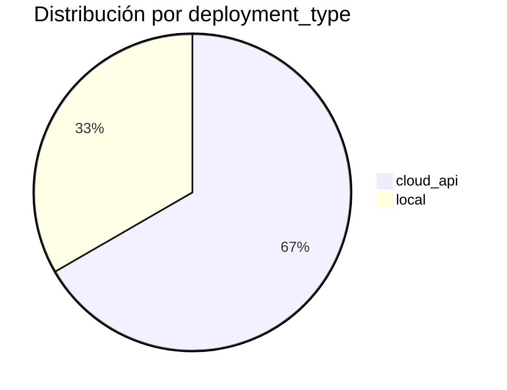
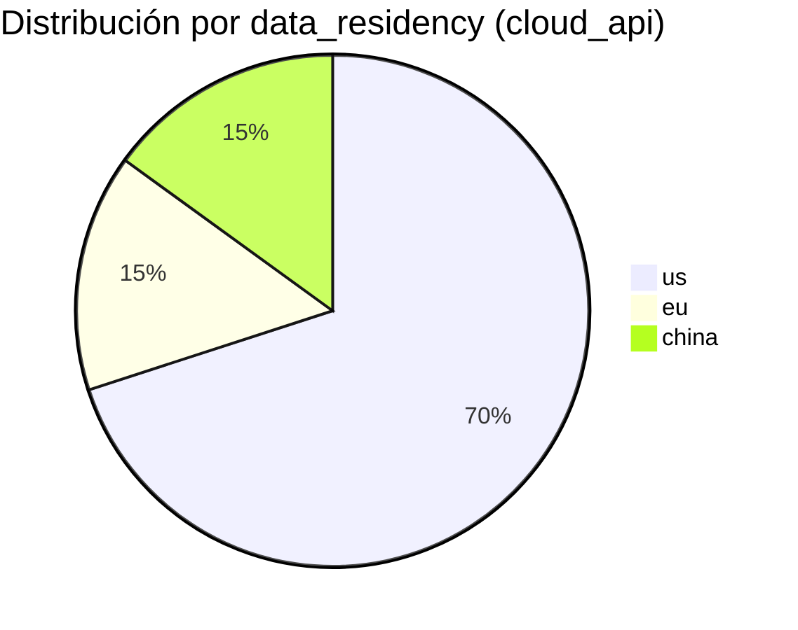
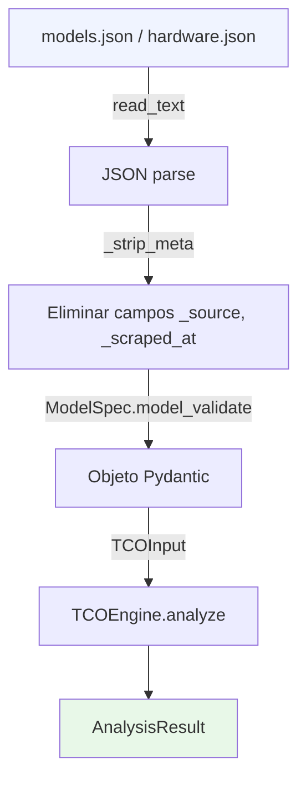

# 📦 Data Catalog — Catálogo Estático de Modelos y Hardware

## 🤔 ¿Qué hago? ¿Cómo lo hago? ¿Y para qué lo hago?

**¿Qué hago?**
Mantengo el inventario de modelos de AI y configuraciones de hardware que el TCO engine utiliza para calcular costes. Sin este catálogo, el engine no tiene datos con qué operar.

**¿Cómo lo hago?**
Los datos se recopilan manualmente de fuentes oficiales (páginas de pricing, datasheets, benchmarks públicos) y se almacenan como JSON estático en `backend/data/`. Cada entrada incluye metadatos de auditoría (`_source`, `_scraped_at`) y se valida contra los modelos Pydantic del engine mediante tests automatizados.

**¿Y para qué lo hago?**
En Phase 1 del producto, el catálogo estático permite validar el engine TCO sin necesidad de una base de datos ni un pipeline de ingestión. En Phase 2, este mismo catálogo migrará a PostgreSQL y se actualizará automáticamente mediante webhooks o scrapers programados.

---

## 🗃️ Contenido del catálogo

```
backend/data/
├── models.json      # 30 modelos AI — cloud API + local/self-hosted
├── hardware.json    # 10 configuraciones GPU/APU
└── README.md        # Fuentes, política de actualización, snippet de carga
```

---

## 🤖 Modelos — 30 entradas

### Distribución





### Cloud API (20 modelos)

| # | ID | Proveedor | Input $/Mtok | Output $/Mtok | Contexto | Residencia | Estado |
| --- | --- | --- | --- | --- | --- | --- | --- |
| 1 | `claude-opus-4-8` | Anthropic | $5.00 | $25.00 | 1M | US | ✅ |
| 2 | `claude-sonnet-4-6` | Anthropic | $3.00 | $15.00 | 1M | US | ✅ |
| 3 | `claude-haiku-4-5` | Anthropic | $1.00 | $5.00 | 200K | US | ✅ |
| 4 | `gpt-4o` | OpenAI | $2.50 | $10.00 | 128K | US | ✅ **baseline** |
| 5 | `gpt-4o-mini` | OpenAI | $0.15 | $0.60 | 128K | US | ✅ |
| 6 | `o3` | OpenAI | $2.00 | $8.00 | 200K | US | ✅ |
| 7 | `o4-mini` | OpenAI | $1.10 | $4.40 | 200K | US | ✅ |
| 8 | `gemini-2-5-pro` | Google | $1.25 | $10.00 | 2M | US | ✅ |
| 9 | `gemini-2-5-flash` | Google | $0.30 | $2.50 | 1M | US | ✅ |
| 10 | `gemini-2-0-flash` | Google | null | null | 1M | US | ⚠️ **DEPRECADO** 1-jun-2026 |
| 11 | `mistral-large-3` | Mistral AI | $0.50 | $1.50 | 128K | EU | ✅ |
| 12 | `mistral-small-4` | Mistral AI | $0.10 | $0.30 | 128K | EU | ✅ |
| 13 | `codestral` | Mistral AI | $0.30 | $0.90 | 32K | EU | ✅ |
| 14 | `command-r-plus` | Cohere | $2.50 | $10.00 | 128K | US | ✅ |
| 15 | `grok-3` | xAI | $3.00 | $15.00 | 131K | US | ✅ |
| 16 | `deepseek-v3` | DeepSeek | $0.14 | $0.28 | 128K | 🇨🇳 CHINA | ⛔ excluido por defecto |
| 17 | `deepseek-r1` | DeepSeek | $0.55 | $2.19 | 128K | 🇨🇳 CHINA | ⛔ excluido por defecto |
| 18 | `llama-3-3-70b-groq` | Groq | $0.59 | $0.79 | 128K | US | ✅ |
| 19 | `llama-4-maverick-together` | Together AI | $0.27 | $0.85 | 1M | US | ✅ |
| 20 | `qwen-2-5-72b-alibaba-api` | Alibaba Cloud | $0.23 | $0.23 | 128K | 🇨🇳 CHINA | ⛔ excluido por defecto |

### Local / Self-hosted (10 modelos)

| # | ID | Proveedor | Params (B) | VRAM mín | tok/s (RTX 4090) | Segmento |
| --- | --- | --- | --- | --- | --- | --- |
| 21 | `llama-4-scout-17b-local` | Meta | 109B total | 24 GB | ~45 | Consumer |
| 22 | `llama-4-maverick-17b-128e-local` | Meta | 400B total | 200 GB | — | Cluster |
| 23 | `llama-3-3-70b-local` | Meta | 70B | 48 GB | ~15-20 | Dual GPU |
| 24 | `llama-3-1-8b-local` | Meta | 8B | 6 GB | ~120 | Edge |
| 25 | `mistral-7b-v03-local` | Mistral AI | 7B | 6 GB | ~130 | Edge |
| 26 | `mixtral-8x7b-local` | Mistral AI | 46.7B total | 28 GB | — | Dual GPU |
| 27 | `phi-4-14b-local` | Microsoft | 14B | 10 GB | ~80 | Consumer |
| 28 | `gemma-3-27b-local` | Google | 27B | 24 GB | ~45 | Consumer |
| 29 | `qwen-2-5-72b-local` | Alibaba | 72B | 48 GB | — | Dual GPU |
| 30 | `deepseek-r1-671b-local` | DeepSeek | 671B total | 376 GB | — | Cluster |

> **Nota sobre compliance en modelos local:** los modelos self-hosted declaran todos los standards (GDPR, HIPAA, SOC2, PCI DSS, ISO 27001, FedRAMP) porque el operador controla completamente los datos. La responsabilidad de compliance recae en el operador, no en el proveedor del modelo.

---

## 🖥️ Hardware — 10 configuraciones

```mermaid
quadrantChart
    title Hardware — VRAM vs Precio
    x-axis Bajo precio --> Alto precio
    y-axis Poca VRAM --> Mucha VRAM
    quadrant-1 Datacenter premium
    quadrant-2 Datacenter accesible
    quadrant-3 Consumer entry
    quadrant-4 Consumer high-end
    RTX 4080 Super: [0.12, 0.11]
    RTX 4090: [0.20, 0.17]
    Dual RTX 4090: [0.43, 0.34]
    RTX 6000 Ada: [0.52, 0.34]
    Mac Studio M3: [0.39, 0.68]
    A100 40GB: [0.60, 0.28]
    A100 80GB: [0.88, 0.57]
    H100 PCIe: [0.20, 0.57]
    H100 SXM5: [0.24, 0.57]
    H200 SXM: [0.28, 1.00]
```

| # | ID | VRAM | TDP | Precio nuevo | Usado | Vida útil |
| --- | --- | --- | --- | --- | --- | --- |
| 1 | `rtx-4090-24gb` | 24 GB | 450W | $2,755 | $2,268 | 36m |
| 2 | `rtx-4080-super-16gb` | 16 GB | 320W | $1,597 | $856 | 36m |
| 3 | `rtx-6000-ada-48gb` | 48 GB | 300W | $7,000 | — | 48m |
| 4 | `a100-40gb-pcie` | 40 GB | 250W | $8,000 | — | 60m |
| 5 | `a100-80gb-sxm4` | 80 GB | 400W | $12,000 | — | 60m |
| 6 | `h100-80gb-pcie` | 80 GB | 350W | $28,000 | — | 60m |
| 7 | `h100-80gb-sxm5` | 80 GB | 700W | $32,000 | — | 60m |
| 8 | `h200-141gb-sxm` | 141 GB | 700W | $38,000 | — | 60m |
| 9 | `mac-studio-m3-ultra-96gb` | 96 GB (unif.) | 370W | $5,299 | — | 48m |
| 10 | `dual-rtx-4090-nvlink` | 48 GB | 900W | $6,010 est. | $5,036 est. | 36m |

---

## 🔄 Flujo de carga en el engine



---

## 🔬 Quality scores — metodología

Todos los scores están normalizados con **GPT-4o = 1.0** como baseline:

| Campo | Fuente principal | Fuente secundaria |
| --- | --- | --- |
| `quality_coding` | HumanEval pass@1 | SWE-bench Verified |
| `quality_reasoning` | Arena Elo (LMSys Chatbot Arena) | MMLU-Pro, GPQA |
| `quality_multilingual` | Estimación editorial | FLORES-200 |

> Los modelos frontier más recientes superan 1.0 en benchmarks específicos (ej. Claude Opus 4.8 = 1.15 en reasoning, o3 = 1.25).

---

## ⚠️ Correcciones aplicadas (jul-2026)

| Enunciado original | Dato real | Motivo |
| --- | --- | --- |
| Mistral Large 2 | Mistral **Large 3** ($0.50/$1.50) | Large 2 retirado del API |
| Mistral Small 3.1 | Mistral **Small 4** ($0.10/$0.30) | Retirado nov-2025 |
| Gemini 2.0 Flash | Precios `null` | Cerrado 1-jun-2026 |
| Mac Studio M4 Ultra 192GB | Mac Studio **M3 Ultra 96GB** ($5,299) | M4 Ultra 192GB nunca existió |
| Llama 4 Maverick 17B×16E | **17B×128 expertos** (400B total) | Arquitectura real en HuggingFace |

---

## 🔗 Documentos relacionados

- [TCO Engine](tco-engine.md) — arquitectura del motor que consume este catálogo
- [backend/data/README.md](../backend/data/README.md) — política de actualización y snippet de carga
