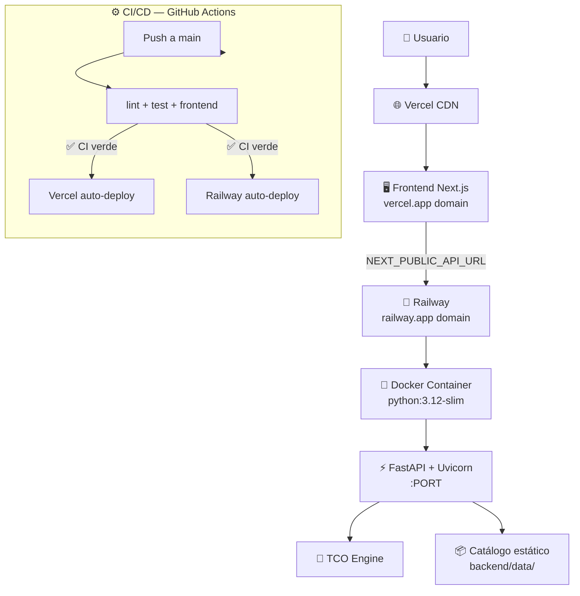
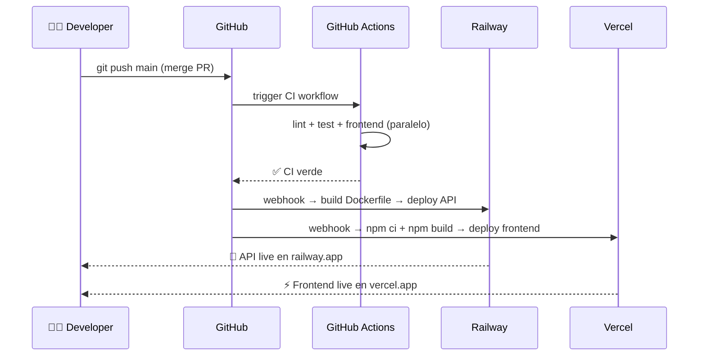

# 🚀 Deploy — klaUS-aicalc-roi

## 🤔 ¿Qué hago? ¿Cómo lo hago? ¿Y para qué lo hago?

**¿Qué hago?**
Gestiono el despliegue a producción de klaUS-aicalc-roi en dos plataformas complementarias: la API FastAPI en Railway y el frontend Next.js en Vercel. Cada componente se despliega de forma independiente y se comunica a través de una variable de entorno.

**¿Cómo lo hago?**
Railway despliega la API usando el `Dockerfile` del repositorio — detecta la imagen automáticamente al conectar el repo GitHub. Vercel despliega el frontend usando el `vercel.json` que apunta al directorio `frontend/` — Next.js se detecta de forma nativa. Ambas plataformas se conectan al repositorio GitHub y despliegan automáticamente en cada merge a `main`.

**¿Y para qué lo hago?**
Sin un entorno de producción accesible, klaUS-aicalc-roi es solo código en un repositorio. El deploy en producción es el punto de inflexión que convierte el MVP en un producto real — con una URL pública, usuarios reales y métricas reales de uso.

---

## 🗺️ Arquitectura de producción



---

## 🏗️ Componentes de deploy

### 🐳 Docker — API (Railway)

| Fichero | Propósito |
| --- | --- |
| `Dockerfile` | Imagen Python 3.12-slim con FastAPI + uvicorn |
| `.dockerignore` | Excluye frontend, tests, .venv, artefactos locales |
| `railway.toml` | Builder dockerfile, healthcheck `/health`, política de restart |

**Variables de entorno Railway:**

| Variable | Valor | Descripción |
| --- | --- | --- |
| `PORT` | Auto (Railway lo inyecta) | Puerto en el que escucha uvicorn |

El endpoint `/health` devuelve `{"status": "ok"}` — Railway lo usa como liveness probe con timeout 30s.

---

### ⚡ Vercel — Frontend (Next.js)

| Fichero | Propósito |
| --- | --- |
| `vercel.json` | `rootDirectory: frontend`, Next.js framework, `npm ci` + `npm run build` |

**Variables de entorno Vercel (configurar en dashboard):**

| Variable | Valor | Descripción |
| --- | --- | --- |
| `NEXT_PUBLIC_API_URL` | `https://<nombre>.railway.app` | URL pública de la API en Railway |

> ⚠️ `NEXT_PUBLIC_API_URL` se embebe en el bundle del cliente en build time. Configurar antes del primer deploy de Vercel.

---

## 🔧 Setup inicial — paso a paso

### 1️⃣ Deploy de la API en Railway

```bash
# Prerrequisito: cuenta Railway + CLI instalada
npm install -g @railway/cli
railway login

# Crear proyecto desde el repo GitHub
railway init
# → Seleccionar "Empty Project" → nombre: klaUS-api

# Conectar el repo
railway connect

# Primer deploy (Railway detecta el Dockerfile automáticamente)
railway up

# Obtener la URL pública
railway domain
# → Copiar este dominio para configurar Vercel
```

O bien desde la web: railway.app → New Project → Deploy from GitHub repo → seleccionar `Ka0s-Klaus/klaUS-aicalc-roi`.

---

### 2️⃣ Deploy del Frontend en Vercel

```bash
# Prerrequisito: cuenta Vercel + CLI instalada
npm install -g vercel
vercel login

# Desde la raíz del repo
vercel

# Configurar variable de entorno con la URL de Railway
vercel env add NEXT_PUBLIC_API_URL production
# → Introducir: https://<nombre>.railway.app

# Redeploy para que tome la variable
vercel --prod
```

O bien desde la web: vercel.com → New Project → Import `Ka0s-Klaus/klaUS-aicalc-roi` → Vercel detecta `vercel.json` automáticamente.

---

### 3️⃣ Verificar el deploy

```bash
# Healthcheck API
curl https://<nombre>.railway.app/health
# → {"status": "ok", "version": "0.1.0"}

# Catálogo de modelos
curl https://<nombre>.railway.app/v1/models | jq '.total'
# → 30

# Frontend accesible
open https://<nombre>.vercel.app
```

---

## 🔁 Flujo de deploys automáticos

Una vez conectados ambos servicios al repo GitHub:



> 📝 Railway y Vercel despliegan de forma independiente tras cada push a `main`. CI no bloquea el deploy de las plataformas — ambas leen el mismo trigger de GitHub. Si CI falla, el equipo debe revisar antes de que el deploy llegue a usuarios.

---

## 🔒 Seguridad

| Control | Estado | Detalle |
| --- | --- | --- |
| Secretos en plataforma | ✅ | Env vars en Railway/Vercel dashboard — nunca en el repo |
| HTTPS forzado | ✅ | Ambas plataformas sirven solo HTTPS por defecto |
| Sin credenciales en Dockerfile | ✅ | Solo deps públicos de PyPI |
| `.dockerignore` | ✅ | Excluye `.env`, `.claude/`, `CLAUDE.md`, `uv.lock` |
| CORS (Fase 2) | ⚠️ | La API acepta cualquier origen — restringir en Fase 2 con `origins=[VERCEL_URL]` |
| Auth (Fase 2) | ❌ | Sin autenticación en Fase 1 — API pública de solo lectura |

---

## 📊 Costes estimados (free tier)

| Plataforma | Plan | Límite free | Coste si se supera |
| --- | --- | --- | --- |
| Railway | Hobby ($5/mes) | 500h ejecución / 5GB egress | $0.000463/min CPU + $0.000231/min RAM |
| Vercel | Free | 100GB bandwidth / 100h build | $20/mes Pro |

Para el MVP con tráfico bajo, ambos planes free/hobby son suficientes.

---

## 🔗 Documentos relacionados

- [CI/CD](ci-cd.md) — pipeline de GitHub Actions que valida antes de cada deploy
- [API REST](api.md) — endpoints que expone la API desplegada en Railway
- [Frontend](frontend.md) — aplicación Next.js desplegada en Vercel
- [TCO Engine](tco-engine.md) — motor de cálculo que corre dentro del contenedor Railway
