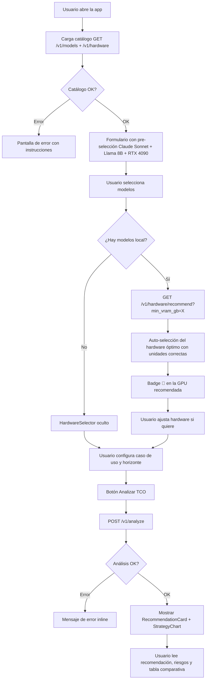

# 🖥️ Frontend — klaUS-aicalc-roi

## 🤔 ¿Qué hago? ¿Cómo lo hago? ¿Y para qué lo hago?

**¿Qué hago?**
Soy la interfaz gráfica del TCO Calculator. Permito que cualquier stakeholder — sin tocar código ni curl — configure un análisis de coste de infraestructura AI, lo lance contra la API REST y visualice los resultados con recomendación y gráfico comparativo.

**¿Cómo lo hago?**
Next.js 15 con App Router, TypeScript strict y TailwindCSS. El frontend es completamente stateless — no tiene base de datos propia. Carga el catálogo de modelos y hardware desde la API en el arranque, gestiona todo el estado en React con `useState`, y lanza `POST /v1/analyze` al pulsar el botón. Los resultados se muestran con un gráfico de barras Recharts y una tarjeta de recomendación.

**¿Y para qué lo hago?**
Para cerrar la Fase 1 MVP: convertir el engine Python y la API REST en una herramienta accesible. Sin esta capa, el sistema solo puede ser usado por desarrolladores que escriban curl o código Python. Con ella, un CTO o un responsable de infraestructura puede comparar estrategias de despliegue AI en 30 segundos.

---

## 🗺️ Flujo de usuario



---

## 📁 Estructura de ficheros

```
frontend/
├── src/
│   ├── app/
│   │   ├── layout.tsx          # Layout global — metadata, fuentes, body
│   │   ├── globals.css         # Estilos base Tailwind
│   │   └── page.tsx            # Página principal — toda la lógica de estado
│   ├── components/
│   │   ├── ModelSelector.tsx   # Selector de modelos AI agrupado por deployment_type
│   │   ├── HardwareSelector.tsx # Selector de hardware GPU (aparece solo si hay modelos local)
│   │   ├── UseCaseForm.tsx     # Nombre, tokens/mes y horizonte de análisis
│   │   ├── StrategyChart.tsx   # Gráfico de barras Recharts + tabla comparativa
│   │   └── RecommendationCard.tsx # Tarjeta de recomendación óptima + excluidos
│   ├── lib/
│   │   └── api.ts              # Cliente fetch tipado — fetchModels, fetchHardware, analyze
│   └── types/
│       └── tco.ts              # Tipos TS que espejan los modelos Pydantic del backend
├── next.config.ts
├── tsconfig.json
└── package.json
```

---

## 🚀 Arrancar en desarrollo

```bash
# Prerrequisito: la API debe estar corriendo
cd ../
uv run uvicorn backend.api.app:app --reload
# En otra terminal:

cd frontend
npm install
npm run dev
# → http://localhost:3000
```

La URL de la API se configura con `NEXT_PUBLIC_API_URL` (default: `http://localhost:8000`):

```bash
NEXT_PUBLIC_API_URL=http://api.ejemplo.com npm run dev
```

---

## 🧩 Componentes

### `ModelSelector`
Agrupa los modelos del catálogo por `deployment_type` y permite selección múltiple con toggle. Muestra el precio de entrada para modelos cloud API.

### `HardwareSelector`
Solo aparece cuando hay al menos un modelo local seleccionado. Muestra cards con VRAM y precio de compra de cada GPU.

Cuando la página detecta modelos locales, llama a `GET /v1/hardware/recommend` y pasa el resultado como `topRecommendation`. El componente:

- Marca con 🤖 la GPU recomendada (borde azul, badge en el header)
- Si la selección actual tiene VRAM insuficiente, la auto-selección se aplica automáticamente con la cantidad de unidades correcta
- El usuario puede cambiar o desmarcar el hardware libremente — la recomendación es informativa, no bloqueante

### `UseCaseForm`
Nombre del caso de uso, tokens de entrada/mes, tokens de salida/mes y selector de horizonte temporal (1, 6, 12, 24, 36, 60 meses).

### `StrategyChart`
Gráfico de barras ordenado por coste ascendente. Color por estado:
- 🔵 Azul: estrategia normal
- 🟢 Verde: Pareto-óptima
- 🟡 Ámbar: Recomendada

Incluye tabla comparativa con CAPEX, OPEX y flag de Pareto.

### `RecommendationCard`
Muestra la recomendación óptima con rationale, riesgos y payback. Si no hay estrategias válidas, muestra los modelos excluidos y sus razones (compliance).

---

## 🔌 Cliente API (`src/lib/api.ts`)

| Función | Método | Endpoint |
| --- | --- | --- |
| `fetchModels(params?)` | GET | `/v1/models?deployment_type=&data_residency=` |
| `fetchHardware()` | GET | `/v1/hardware` |
| `fetchHardwareRecommendation(min_vram_gb)` | GET | `/v1/hardware/recommend?min_vram_gb=` |
| `analyze(input)` | POST | `/v1/analyze` |

Todos devuelven promesas tipadas. Los errores HTTP lanzan `Error` con el status y body — se capturan en el `catch` de la página.

---

## ⚡ Decisiones de diseño

| Decisión | Razón |
| --- | --- |
| Single-page, sin routing | MVP Fase 1 — una sola pantalla es suficiente para el flujo completo |
| Estado en `useState`, sin Zustand/Redux | La complejidad no justifica un store externo en esta fase |
| Pre-selección al arrancar | Reduce la fricción — el usuario puede lanzar un análisis en 1 clic |
| `"use client"` en toda la página | El formulario y el gráfico son interactivos — no hay beneficio de RSC aquí |
| Recharts (no Chart.js/D3) | Componentes React nativos, sin manipulación de DOM, tipado completo |
| Auto-recomendación en cliente (no SSR) | La llamada a `/v1/hardware/recommend` se hace desde `useEffect` — evita bloquear el render inicial y permite que el usuario vea el formulario antes de que llegue la recomendación |
| `useRef` para `lastAutoSelectKey` | Evita re-selección de hardware en cada re-render; solo se re-aplica cuando el conjunto de modelos locales cambia realmente |

---

## 🔒 Seguridad

- Sin auth en Fase 1 MVP — la API es local.
- `NEXT_PUBLIC_API_URL` es la única variable de entorno — no expone secretos.
- No hay llamadas a APIs de terceros desde el frontend.
- El frontend no guarda datos del usuario — todo el estado es efímero (en memoria del navegador, limpiado al recargar).

---

## 🔗 Documentos relacionados

- [API REST](api.md) — endpoints que consume este frontend
- [TCO Engine](tco-engine.md) — motor de cálculo detrás de la API
- [Data Catalog](data-catalog.md) — catálogo de modelos y hardware
