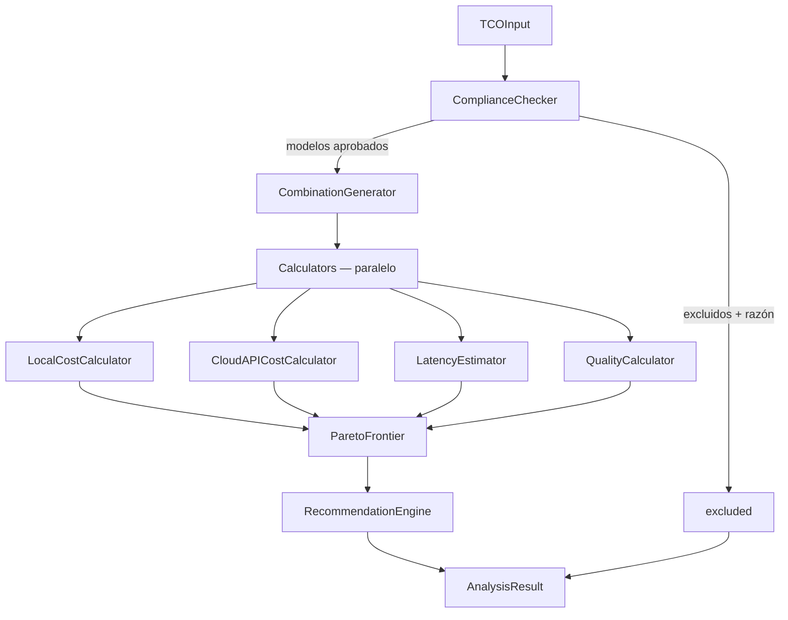

# 🧮 TCO Engine — Documentación

## 🤔 ¿Qué hago? ¿Cómo lo hago? ¿Y para qué lo hago?

**Qué hago:** Soy el núcleo de klaUS-aicalc-roi. Calculo el Coste Total de Propiedad (TCO) de cualquier combinación de modelo de IA × hardware × proveedor cloud para un caso de uso específico.

**Cómo lo hago:** Pipeline de 5 pasos: filtrado de compliance → generación de combinaciones → cálculo paralelo de métricas → Pareto Frontier → recomendación automática con justificación.

**Para qué lo hago:** Eliminar el análisis manual en spreadsheets que hoy consume 100+ horas de CTO/MLOps time por decisión. Una llamada a `TCOEngine.analyze()` produce el mismo resultado en milisegundos.

---

## 🏗️ Arquitectura del engine



---

## 📐 Modelos de datos

### Entrada — `TCOInput`

| Campo | Tipo | Descripción |
| --- | --- | --- |
| `models` | `list[ModelSpec]` | Modelos a comparar (mín. 1) |
| `hardware` | `list[HardwareSpec]` | Hardware local disponible |
| `use_cases` | `list[UseCase]` | Carga de trabajo (Fase 1: solo 1) |
| `compliance` | `ComplianceFilter` | Filtros de cumplimiento normativo |
| `electricity_cost_usd_kwh` | `Decimal` | Precio electricidad local (default: $0.25) |
| `horizon_months` | `int` | Horizonte de análisis (default: 36) |

### Salida — `AnalysisResult`

| Campo | Tipo | Descripción |
| --- | --- | --- |
| `strategies` | `list[StrategyCost]` | Coste desglosado por combinación |
| `pareto_optimal_ids` | `list[str]` | IDs de estrategias en la frontera de Pareto |
| `recommendation` | `Recommendation` | Mejor opción + justificación + riesgos |
| `excluded` | `list[dict]` | Combinaciones descartadas + motivo |

---

## 🧮 Fórmulas de cálculo

### CAPEX (local)
```
CAPEX = hardware.purchase_price
```

### OPEX mensual (local)
```
power_kw = tdp_watts × (1 + cooling_overhead) × 0.001
monthly_electricity = power_kw × 730h × electricity_usd_kwh
monthly_maintenance = purchase_price × maintenance_annual_pct / 12
```

### Coste API (cloud)
```
monthly_cost = (input_tokens / 1_000_000) × input_price_per_mtok
             + (output_tokens / 1_000_000) × output_price_per_mtok
```

### Break-even (local vs cloud)
```
monthly_savings = cloud_monthly_avg - local_monthly_avg
breakeven_month = CAPEX / monthly_savings  (si monthly_savings > 0)
```

---

## 🔒 Compliance — filtros de seguridad

El `ComplianceChecker` es el **primer paso** del pipeline — ninguna combinación no conforme llega a los calculadores.

| Filtro | Comportamiento |
| --- | --- |
| `exclude_china_models=True` (default) | Excluye modelos con `data_residency=CHINA`, añade warning explícito |
| `allowed_residencies` | Excluye cualquier residencia no listada |
| `required_standards` | Añade warning (no excluye) si el modelo carece de la certificación |

⚠️ **Importante:** Modelos de providers chinos (DeepSeek, Qwen, GLM) pueden no satisfacer GDPR, HIPAA ni FedRAMP. El engine los excluye por defecto y muestra el motivo en `AnalysisResult.excluded`.

---

## 🎯 Algoritmo Pareto Frontier

Una estrategia A domina a B si:
- `A.total_cost_usd ≤ B.total_cost_usd` **Y**
- `A.quality_score ≥ B.quality_score` **Y**
- Al menos una de las dos condiciones es estricta

Las estrategias no dominadas forman la frontera de Pareto: el conjunto de trade-offs óptimos entre coste y calidad.

---

## 🧪 Tests

```bash
pytest backend/tests/test_tco_engine.py -v
```

Cobertura obligatoria:
- ✅ Cálculo cloud API (verificación aritmética exacta)
- ✅ Cálculo local (CAPEX + OPEX + break-even)
- ✅ Exclusión por VRAM insuficiente
- ✅ Filtro compliance China (default ON y OFF)
- ✅ Filtro de residencia geográfica
- ✅ Pareto frontier y recomendación con estrategias mixtas

---

## 🔗 Documentos relacionados

- [README.md](../README.md) — Visión del producto
- Spec técnica completa: `04-TCO-ENGINE-ARCHITECTURE.md` (local, no en repo)
